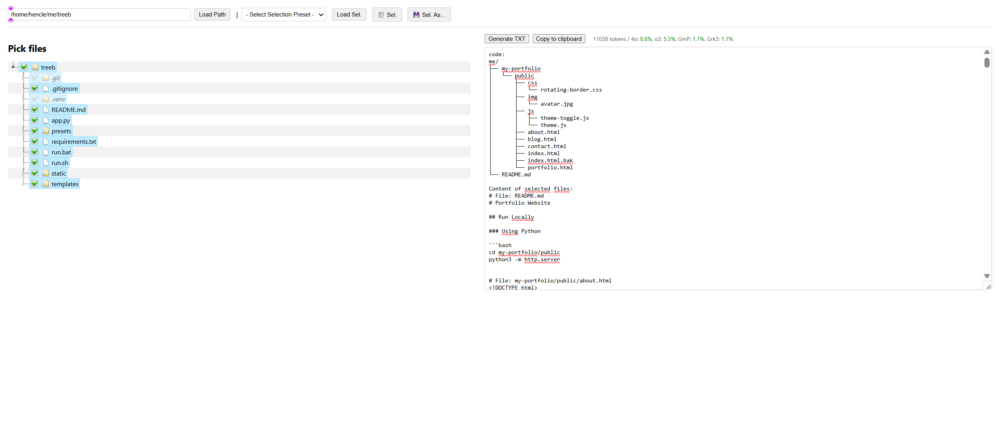

# treeb

Flatten repos and feed it into llms


*(To make the image display: create an `assets` folder in your project root, place `treeb-ui-screenshot.png` inside it, and commit both.)*

`treeb` provides a web UI to visually select files and directories, then generates a combined text output including an ASCII tree and file contents. It's designed for preparing context for Large Language Models.

## Key Features

* **Visual File/Directory Selection**: Interactive tree view to pick your context.
* **Combined Text Output**: Generates an ASCII tree of the selected structure plus the content of selected files.
* **LLM Context Awareness**:
    * Displays **token count** of the output (using `tiktoken`).
    * Shows context window usage **percentages for major LLMs**, color-coded for quick insight.
* **Selection Presets**: Save and load frequently used file/directory selections. Starts with an empty "default" preset.
* **Automatic Exclusions**: Common ignored items (like `.git`, `node_modules`, `__pycache__`) are visually marked as excluded (greyed out, non-selectable) and omitted from the generated output.

## Run (Unix)

```bash
chmod +x run.sh
./run.sh
````

## Run (Windows)

```bat
run.bat
```

After running, open `http://127.0.0.1:5000` in your browser. The scripts will attempt to set up a Python virtual environment and install dependencies (`Flask`, `tiktoken`). Python 3.7+ is required.

